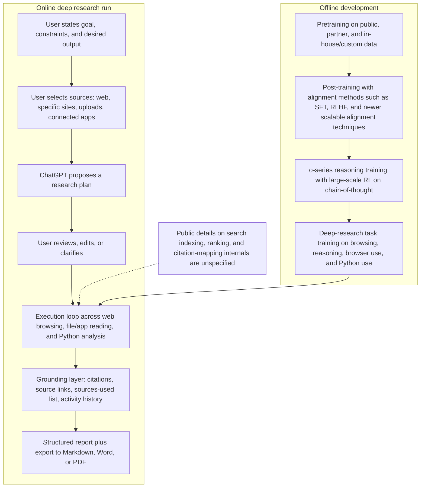

# How ChatGPT Performs Deep Research

## Executive summary

OpenAI’s public documentation indicates that ChatGPT’s deep research feature is an **agentic research workflow**, not merely a longer answer. In its current form, the workflow lets a user define a goal, choose or restrict sources, review and edit a proposed research plan, watch the run in progress, interrupt it if needed, and receive a structured report with citations or source links, a sources-used section, and an activity history. At launch, OpenAI said deep research was powered by a version of **o3** optimised for web browsing and data analysis; current Help Centre documentation says deep research is powered by the **latest models by default**, with legacy-model choice still available. 

Under the hood, OpenAI discloses only part of the stack. The clearest public picture is a layered one: a general GPT foundation-model pipeline; an **o-series reasoning layer** trained with large-scale reinforcement learning on chain-of-thought and tool use; and a deep-research product layer trained end-to-end on hard browsing-and-reasoning tasks that use browser and Python tools. OpenAI also states that o-series models can use tools **inside** their reasoning process. What remains undisclosed is notable: OpenAI does **not** publish the exact current architecture, parameter counts, search/indexing/ranking internals, or raw chain-of-thought for ChatGPT deep research. 

The attached “Deep Seek Research” material points in a different direction. It frames DeepSeek primarily as an **OpenAI-compatible reasoning API/model family** with exposed reasoning output, explicit thinking controls, and more openly documented model-side details. That aligns with official DeepSeek documentation showing OpenAI/Anthropic-compatible API formats, explicit `thinking`/`reasoning_effort` controls, exposed `reasoning_content`, and published model papers that disclose MoE/MLA-style architectures for DeepSeek-V3 and reinforcement-learning-heavy reasoning development for DeepSeek-R1. The strongest overlap with OpenAI is at the high level—reasoning, RL, and tool use. The biggest divergence is in **transparency and product scope**: OpenAI exposes more policy/process governance and a richer end-user research workflow, while DeepSeek exposes more API-level reasoning detail and more model internals.  

For researchers and practitioners, the practical conclusion is that ChatGPT deep research is best understood as a **closed, controllable, citation-oriented research assistant**. It is strong when the task is source-bounded synthesis, evidence gathering, and long-form reporting. It is weaker when the requirement is full reproducibility, exact replay, or inspection of every reasoning step. OpenAI’s own materials support this mixed assessment: it offers plan control, source control, citations, exports, model specs, and system cards, but also updates models over time, hides raw chain-of-thought, and acknowledges that production behaviour can vary with updates and prompts. 

## Assumptions and evidence base

The attached document is **present**, but it is best characterised as a **pasted transcript / compiled note** rather than a formal DeepSeek technical white paper. It appears to mix local AI Wiki context, a tool-generated summary of DeepSeek capabilities, and direct or indirect claims about DeepSeek model families and API behaviour. That makes it useful as a comparison artefact, but weaker than a primary source where it goes beyond what the cited DeepSeek documentation itself clearly states. 

This report therefore prioritises, in order, official OpenAI product documentation, OpenAI system cards and alignment papers, primary model papers, official DeepSeek API/model documentation, and benchmark papers. Where OpenAI or DeepSeek does not specify a detail—especially around exact architecture, indexing, or deployment internals—the report marks it as **unspecified** rather than inferring beyond the public record. 

A further methodological caveat matters. The comparison is not fully like-for-like. OpenAI deep research is a **consumer/product workflow** for scoped, documented research, whereas the attached DeepSeek note is closer to a **model/API summary**, not a documented DeepSeek consumer deep-research product with the same plan-review, report-view, and source-control UX. Some apparent discrepancies are therefore actually differences in **layer of abstraction**.  

## Side-by-side comparison

| Attribute | ChatGPT deep research | Attached Deep Seek note | Agreements, discrepancies, and likely reasons |
|---|---|---|---|
| Model architecture and training pipeline | OpenAI says deep research launched on an o3-derived model optimised for browsing/data analysis, trained end-to-end on hard browsing-and-reasoning tasks and on browser/Python tool use; broader o-series models are trained with large-scale RL on chain-of-thought and can use tools in their CoT.  | The attachment presents DeepSeek as a reasoning-first API/model family with explicit thinking controls and cites/openly references MoE/MLA/RL-style development. Official DeepSeek papers support MoE/MLA for V3 and pure-RL reasoning development for R1.   | Agreement: both centre reasoning + RL + tools. Discrepancy: OpenAI does not disclose exact current deep-research architecture; DeepSeek disclosures are more model-specific. Likely reason: closed-service safety/competition trade-offs versus open-weight/API strategy. |
| Data sources and curation | OpenAI describes training data at a high level as public data, partnership/proprietary data, and in-house/custom data, with filtering to reduce personal information and harmful/sensitive content; individual ChatGPT content may train models unless opted out, while business/API data is not used by default.  | The attachment emphasises DeepSeek’s public/open-data and cost-efficiency narrative more than privacy controls; official DeepSeek-V3 materials describe 14.8T high-quality tokens and later SFT/RL stages, while R1 release materials emphasise openness and distillation.   | Agreement: both rely on large-scale pretraining plus post-training. Discrepancy: OpenAI foregrounds privacy controls and filtering; the DeepSeek note foregrounds openness, cost, and distillation. Likely reason: product/privacy commitments versus model-release positioning. |
| Retrieval, indexing, and grounding | Deep research can use the public web, uploaded files, specific sites, and connected apps; apps are read-only in research; outputs include citations/source links, sources used, and activity history. Search/indexing/ranking internals are not publicly specified.  | The attachment and official DeepSeek docs focus on API compatibility, long context, thinking mode, and tool calls, but not on a comparable first-party research-product indexing/grounding workflow.   | Agreement: both support tool-augmented information work. Discrepancy: OpenAI documents a report-generation workflow; the DeepSeek note documents a model/API substrate. Likely reason: consumer research product versus developer-facing API. |
| Prompt engineering and chain-of-thought | ChatGPT deep research proposes a plan before execution, may ask clarifying questions, lets the user edit that plan, and can be interrupted mid-run. OpenAI hides raw CoT but shows summaries/activity history; Model Spec and alignment docs treat tool outputs/files as untrusted by default.  | The attachment highlights exposed `reasoning_content`, `thinking` mode, and `reasoning_effort`; current DeepSeek reasoning docs state CoT is returned as `reasoning_content` and should not be replayed into the next request for `deepseek-reasoner`.   | Agreement: reasoning is a first-class object in both systems. Discrepancy: OpenAI hides raw reasoning; DeepSeek exposes it at the API level. Likely reason: OpenAI’s safety-monitoring and UX position versus DeepSeek’s API transparency/distillation position. |
| Evaluation metrics, benchmarks, and human-in-the-loop | OpenAI reports deep research scores of 26.6% on HLE with browsing+Python and SOTA on GAIA; broader o-series work includes AIME, GPQA, Codeforces, human-preference evals by trainers, internal safety testing, external red teaming, and early external safety access.  | The attachment stresses DeepSeek reasoning parity claims and cost/performance narratives; official DeepSeek-R1 release says performance is on par with o1 and highlights maths/code/reasoning rather than a documented research-agent evaluation programme.   | Agreement: both lean heavily on reasoning benchmarks. Discrepancy: OpenAI documents product-level research-agent evals and human oversight; the DeepSeek note centres model benchmarks. Likely reason: one is a research product, the other mostly a model/API note. |
| Safety, alignment, and bias mitigation | OpenAI documents deliberative alignment, Preparedness Framework gating, model/system cards, instruction hierarchy, bias and hallucination evals, moderation/safety classifiers, and privacy/admin controls.  | The attachment says comparatively little about DeepSeek safety or bias mitigation; official DeepSeek docs here focus on API behaviour, model access, and openness rather than a comparable public safety stack.   | Agreement: both constrain behaviour through product/API design. Discrepancy: OpenAI publishes a much richer public alignment/governance story. Likely reason: different documentation priorities, deployment models, and trust requirements. |
| Transparency, explainability, and reproducibility | OpenAI publishes citations, report exports, activity history, system cards, and Model Spec, but withholds raw CoT and many model/deployment details; it also states that production models do not yet fully reflect the public Model Spec and that performance can vary with updates.  | The attachment and official DeepSeek materials offer more API-level transparency—exposed CoT, pricing, context length, OpenAI-compatible requests, and more detailed model papers—while also mixing versions and claims in a way that reduces strict reproducibility of the attachment itself.   | OpenAI is more transparent about policy and process; DeepSeek is more transparent about model/API surfaces. Each is only partially transparent. |
| Practical implications | Best used as a controllable research assistant for synthesis, source-constrained analysis, and report production, especially where citations, source controls, and exports matter.  | Best interpreted, from the attachment, as a reasoning-model/API stack that developers can integrate into their own agents and workflows.   | The systems overlap in capability primitives, but not in operating model. Practitioners should not assume parity between “a reasoning model with tools” and “a finished deep-research product”. |

## ChatGPT deep research pipeline

OpenAI’s published materials support a two-level pipeline: an **offline model-development pipeline** and an **online task-execution pipeline**. The latter is comparatively well documented; the former is only partially disclosed. The most defensible reading is that OpenAI combines general foundation-model pretraining, post-training alignment, reasoning-model RL, and then product/task-specific training for browsing-and-analysis behaviour. At runtime, the user-facing system adds source choice, plan review, execution monitoring, and grounded report generation. 

The key comparison point with the attached DeepSeek note is that OpenAI’s pipeline is explicitly a **report-generation product workflow**. The DeepSeek material, by contrast, mostly describes a **reasoning model/API surface**—OpenAI-compatible request format, thinking controls, context length, and exposed reasoning output—rather than a first-party end-to-end research UX with plan review, activity history, and source governance.  

## Comparative analysis

### Model architecture and training pipeline

OpenAI’s public disclosure supports a cautious but clear account. The original deep research launch says the feature is powered by “a version of the upcoming OpenAI o3 model” optimised for web browsing and data analysis. It also says deep research was trained on real-world tasks requiring browser and Python tool use, and later says the system was trained end-to-end on hard browsing-and-reasoning tasks to learn multi-step trajectories with backtracking and adaptation. In parallel, OpenAI’s o-series documentation says the models are trained with large-scale reinforcement learning on chain-of-thought, and that o3/o4-mini can use tools within their chains of thought. 

That said, the architecture disclosure stops early. The GPT-4 Technical Report confirms a **Transformer-based** next-token-prediction foundation with post-training alignment, but OpenAI does not publish the precise current deep-research model architecture, parameter count, mixture-of-experts status, or search/ranking stack. Current Help Centre language also shows backend evolution: deep research is now “powered by the latest models” by default, rather than being permanently tied to one named backend. 

The attached DeepSeek note is materially more model-explicit. It emphasises named model families, OpenAI-compatible API calls, explicit thinking controls, and a reasoning-specific output field. Official DeepSeek materials back much of that general framing: the API is OpenAI/Anthropic-compatible, current models expose thinking mode and reasoning effort, and DeepSeek-V3’s paper explicitly describes a 671B-parameter MoE model using MLA/DeepSeekMoE, while DeepSeek-R1’s paper foregrounds pure-RL reasoning development.  

The two systems therefore agree on the **importance of reasoning + RL + tool use**, but they diverge sharply on disclosure style. OpenAI documents the existence of the reasoning/tool pipeline while withholding most internals; DeepSeek publishes more architecture- and API-level mechanics. The likeliest causes are closed-service competition, safety-monitoring strategy, and product positioning on the OpenAI side, versus open-weight/API adoption incentives on the DeepSeek side. 

### Data sources and curation practices

On training data, OpenAI’s most precise public statements are general rather than deep-research-specific. The GPT-4.5 System Card says GPT-4.5 was pre-trained and post-trained on a mix of **publicly available data, proprietary data from partnerships, and custom in-house datasets**, and that OpenAI applies rigorous filtering, including steps to reduce personal information and to screen harmful or sensitive content with moderation and safety classifiers. OpenAI’s privacy pages add that individual ChatGPT content may be used for training unless the user opts out, whereas business tiers and the API do not train on inputs/outputs by default. 

For deep research specifically, OpenAI’s runtime data-access model is more visible than its offline corpus composition. The feature can read the public web, uploaded files, specific sites, and connected apps; for business contexts, OpenAI states that app-sourced data is not used for training by default and that organisations control connected internal sources. This makes deep research better documented as a **runtime data orchestration system** than as a uniquely disclosed training corpus. 

The attached DeepSeek note leans in a different direction. It emphasises DeepSeek’s openness, cost-efficiency, and model-weight/API availability more than privacy governance. Official DeepSeek-V3 materials support the open-data/open-cost narrative to a degree: the paper says V3 was pre-trained on **14.8 trillion diverse and high-quality tokens**, then post-trained with SFT and RL. The R1 release page also explicitly encourages use of outputs for fine-tuning and distillation, which is a markedly different posture from OpenAI’s consumer-product privacy framing.  

So the agreement is broad—both ecosystems combine large-scale pretraining with post-training—but the emphasis differs. OpenAI foregrounds filtering, privacy reduction, moderation, and enterprise data segregation; the DeepSeek note foregrounds openness and distillation. That is partly a product decision and partly a documentation decision. 

### Retrieval, indexing, and grounding methods

This is where OpenAI’s deep research product is most concretely described. The Help Centre says a user can choose the permitted source set before a run, including the public web, uploaded files, connected apps, or specific sites/domains. The user can either restrict research to listed sites or prioritise those sites while still allowing broader web search. Connected apps are explicitly read-only for research. The completed output includes citations or source links, a sources-used section, and an activity history. OpenAI’s February 2026 update adds MCP/app connectivity, trusted-site restriction, real-time progress tracking, and interruption/refinement mid-run. 

What OpenAI does **not** publish is just as important: there is no public specification of the search engine(s), indexing strategy, ranking/re-ranking process, duplicate clustering, freshness policy, or exactly how citation spans are attached to generated prose. That opacity limits strict reproducibility and technical verification, even though the product is visibly more grounded than standard chat. 

The attached DeepSeek note is not comparable on this axis, because it mainly describes an API and model surface. Official DeepSeek docs expose 1M context, tool calls, thinking mode, and OpenAI-compatible chat completions, but they do not document an equivalent first-party research-product pipeline with plan review, source governance, activity history, and long-form cited report exports. In other words, DeepSeek provides primitives for agent builders; OpenAI documents a finished research workflow.  

The apparent discrepancy therefore does not necessarily mean that OpenAI has “better retrieval” in a model-scientific sense. It means OpenAI has publicly documented a **more mature end-user grounding product**, while the DeepSeek note and docs describe a **more generic toolkit surface**. 

### Prompt engineering, planning, and chain-of-thought techniques

OpenAI’s deep research product introduces a strong **planning layer** in front of execution. The user describes the desired outcome and permitted sources; ChatGPT then proposes a research plan that the user can review and modify before the run starts. During execution, the user can track progress, interrupt the run, refine focus, and adjust source access. OpenAI also notes that deep research may ask clarifying questions before it begins. 

Beneath that UI layer is the o-series reasoning approach. OpenAI says o1/o-series models use chain-of-thought learned via reinforcement learning; the model learns to refine strategies, correct mistakes, and try alternate approaches. But OpenAI also explicitly says it will **not show the raw chain of thought** to users. Instead, it shows summaries or product-level activity traces. The rationale is safety and monitoring: OpenAI says hidden CoT could help monitor model intent, and that exposing unaligned raw CoT directly to users is undesirable. 

The attached DeepSeek note is almost the mirror image here. It presents reasoning as a user/developer-visible object through `reasoning_content`, together with explicit thinking toggles. Current DeepSeek reasoning docs confirm that the API exposes `reasoning_content` beside the final answer, and that for `deepseek-reasoner` this field should **not** be fed back into the next turn or the API returns an error. That is a materially different CoT governance choice from OpenAI’s hidden-CoT stance.  

OpenAI also places this in a stronger instruction-governance frame. The Model Spec publishes a chain of command, and it explicitly says quoted text, files, multimodal inputs, and tool outputs are **untrusted by default** unless a higher-level instruction delegates authority to them. For a research product that reads websites, files, and connectors, that matters: it is an explicit public defence posture against prompt injection. The attached DeepSeek note does not provide a comparable public instruction-authority framework.  

### Evaluation metrics, benchmarks, and human-in-the-loop processes

OpenAI’s public evaluation story for deep research is relatively strong. In the launch materials, OpenAI reports **26.6% accuracy on Humanity’s Last Exam** for the model powering deep research with browsing and Python, and a new state of the art on **GAIA**. This matters because GAIA was designed specifically for assistants that need reasoning, multimodality, browsing, and tool use, making it a good fit for a deep-research agent. HLE is more complicated: its benchmark paper says questions are designed not to be quickly answerable by internet retrieval, so a high deep-research score there is partly evidence of reasoning generality, not just web search. 

OpenAI also publishes a broader human-and-model evaluation stack around its reasoning line. The o1 materials report benchmark gains on AIME, GPQA, MMMU, and Codeforces, and describe a human-preference study in which human trainers compared anonymised outputs from o1-preview and GPT-4o on difficult open-ended prompts. OpenAI further documents internal safety testing, external red teaming, and an early-access programme for outside safety researchers, including collaboration with third-party testing organisations and national AI safety institutes. 

The attached DeepSeek note and official DeepSeek release materials tell a narrower story. The emphasis is on performance parity with o1, reasoning gains in maths/code/logic, low cost, and distillability. What is missing is a clearly published, first-party evaluation stack for a DeepSeek **research agent as product**, including plan-quality evaluation, citation faithfulness evaluation, or human-preference processes tied to a report-generation UX.  

That does not imply DeepSeek lacks rigorous evaluation internally; it means the public comparison artefact provided here does not document it. The most likely reason is scope: OpenAI is discussing a finished research workflow, while the DeepSeek note is discussing a model/API family. 

### Safety, alignment, and bias mitigation strategies

OpenAI is much more explicit here than the attached DeepSeek note. It publishes a multi-part safety stack: the Model Spec, system cards, Preparedness scorecards, moderation/safety classifiers, instruction hierarchy work, and **deliberative alignment**, a method that teaches reasoning models the text of safety specifications and trains them to reason over those specifications before answering. OpenAI says this approach improved adherence to safety policies without requiring human-labelled CoTs or answers. 

The system-card evidence is concrete. GPT-4.5’s card states that OpenAI evaluates harmfulness, jailbreak robustness, hallucinations, and demographic fairness, and that it uses public and internal evaluations plus external red teaming. It reports refusal metrics, jailbreak metrics, PersonQA hallucination results, BBQ fairness results, and instruction-hierarchy evaluations for conflict between system and user prompts. The o3/o4-mini system card adds that these models combine reasoning with full tool capabilities and can reason about safety policies “through deliberative alignment.” 

For deep research specifically, source handling is also part of safety posture. The Help Centre says connected apps are read-only, and enterprise/admin controls include RBAC and standard ChatGPT privacy settings. For business tiers, OpenAI says data from ChatGPT Business/Enterprise/Edu/API is not used for training by default, and connected internal sources are organisation-controlled. 

The attached DeepSeek note offers little comparable material. DeepSeek’s official docs in the corpus used here document API compatibility, pricing, context length, reasoning output, and openness, but not a similarly rich public alignment, bias, and preparedness stack. The discrepancy therefore lies less in proven capability than in **public governance disclosure**. OpenAI provides more auditable public policy/process artefacts; the DeepSeek note does not.  

### Transparency, explainability, and reproducibility

OpenAI’s transparency model is selective. On the positive side, it provides citations/source links in deep research, a sources-used section, an activity history, report exports, public system cards, alignment papers, and an openly published Model Spec. The Model Spec explicitly says OpenAI is training models to align to that specification and publishes it to deepen public discussion. 

But OpenAI is equally explicit about what it does **not** reveal. The GPT-4 report is minimal on architecture, raw chain-of-thought is hidden, and production behaviour can vary slightly with system updates, final parameters, and prompts. The Model Spec also says current production models do not yet fully reflect the public spec. For scientific reproducibility, those are real limits: the same prompt can change with model updates, source freshness, hidden ranking differences, and unavailable raw reasoning traces. 

The DeepSeek side is stronger on some forms of reproducibility. Official docs expose request schemas, reasoning fields, pricing, context lengths, and OpenAI-compatible integration patterns, while model papers provide more architecture details and, for some releases, open weights/licensing. The attached note reflects that API/model-level openness. At the same time, the attachment itself is a mixed-source transcript, not a clean technical report, and some of its claims—such as certain parameter counts or newer behaviour nuances—are not fully verifiable from the official DeepSeek pages retrieved here.  

The net result is a trade-off. OpenAI is more transparent about **policy, behavioural governance, and user-facing provenance**, while DeepSeek is more transparent about **API and model mechanics**. Researchers who care about reproducible model science will usually prefer the latter; practitioners who care about enterprise controls and a governed deep-research workflow may prefer the former. 

## Limitations and open questions

The first open question is architectural opacity. OpenAI does not publicly specify the exact current deep-research backend, its search/indexing/ranking implementation, citation-mapping internals, or the full runtime tool orchestration logic. Because the Help Centre now says deep research is powered by the “latest models” by default, backend drift over time is part of the product design. That is good for iterative improvement, but bad for exact replay and method transparency. 

The second open question is evaluation adequacy. GAIA is highly relevant to research agents, but HLE is partly orthogonal because it was designed so that questions cannot be quickly answered by internet retrieval. In addition, later work such as HLE-Verified argues that non-trivial benchmark noise can significantly alter cross-model comparisons. So benchmark leadership should not be read as a complete measure of real-world deep-research reliability, citation faithfulness, or robustness to adversarial sources. 

The third open question is source trust and prompt injection. OpenAI’s own Model Spec makes clear that files, quoted text, and tool outputs are untrusted by default, which implies that prompt injection is not a solved problem but an active design constraint. For a product that reads websites, PDFs, and enterprise connectors, this is a critical threat model. Public docs describe the governance principle, but not a full public quantitative injection-resilience programme specific to deep research. 

The fourth open question is explainability. OpenAI’s decision to hide raw chain-of-thought may improve safety and monitoring, but it necessarily reduces external auditability and mechanistic transparency. The attachment’s DeepSeek framing highlights the opposite choice—more exposed reasoning text—which improves inspectability but changes the safety and competitive trade-space. Neither approach is cost-free.  

A final limitation of this comparison is scope mismatch. The attached document is not a formally equivalent DeepSeek deep-research product spec. It is closer to a reasoning-model/API note with some ancillary local-tool context. That means any “winner” narrative would be methodologically weak. The cleaner conclusion is that OpenAI and DeepSeek are optimising for different points in the design space: governed research workflow versus transparent reasoning-model surface.  

## Implications, recommendations, and audit ideas

For researchers, the main implication is that ChatGPT deep research should be treated as an **interactive evidence-synthesis system** rather than a transparent scientific instrument. Its best use cases are scoped literature reviews, policy or market scans, competitive intelligence, and source-constrained domain synthesis where exported reports, citation trails, and activity history add practical value. Its weaker use cases are those that demand stable replay, full reasoning trace inspection, or precise claims about internal search/index design. 

For practitioners, the strongest operational pattern is to **bound the source set and review the plan before execution**. OpenAI explicitly supports trusted-site restriction, prioritised domains, uploads, connected apps, plan review, and run interruption. In practice, that means the system is most defensible when it is used less like an unconstrained web crawler and more like a supervised research assistant working inside a known evidence perimeter. 

Recommended follow-up experiments and audits are straightforward:

- **Source-set ablation audit.** Run the same task with full web, trusted domains only, and web-plus-uploads to measure how strongly conclusions depend on retrieval scope. OpenAI’s source controls make this directly testable. 
- **Citation-faithfulness audit.** Sample every major claim in a report, verify whether the cited source really supports the sentence, and score omission, misquotation, and over-interpretation rates. OpenAI’s report citations and sources-used section make this operationally feasible. 
- **Prompt-injection red-team.** Seed malicious instructions into uploaded files, quoted text, or hostile pages and test whether the system obeys them. This directly probes the “untrusted data by default” design principle. 
- **Reproducibility drift audit.** Re-run identical prompts over several days and across default versus legacy-model selection to measure variance introduced by model and web drift. OpenAI explicitly supports legacy-model selection for deep research and acknowledges production variation. 
- **Benchmark-to-product gap audit.** Compare performance on GAIA-like tasks, HLE-style hard questions, and real organisational tasks to see where benchmark wins do or do not predict practical research quality. 

Concise actionable recommendations follow from that:

- Use **specific-site restriction** for high-stakes work instead of unrestricted web search. 
- Review and, when necessary, **edit the proposed plan** before execution starts. 
- Export and archive the report **with its cited sources** for later verification or challenge. 
- For confidential or regulated workflows, prefer business/enterprise environments where OpenAI says data is **not used for training by default** and source access is admin-controlled. 
- Do not treat “summary of thinking” or activity history as equivalent to a full reasoning trace; for that level of inspection, the current OpenAI product is structurally limited. 

## Source URLs

The attached file has no public URL; it was supplied directly in chat as a local upload. Other cited sources are listed below.

- OpenAI, *Introducing deep research*  
  `https://openai.com/index/introducing-deep-research/`

- OpenAI Help Centre, *Deep research in ChatGPT*  
  `https://help.openai.com/en/articles/10500283-deep-research-faq`

- OpenAI, *Learning to reason with LLMs*  
  `https://openai.com/index/learning-to-reason-with-llms/`

- OpenAI, *Introducing OpenAI o1-preview*  
  `https://openai.com/index/introducing-openai-o1-preview/`

- OpenAI, *OpenAI o3 and o4-mini System Card*  
  `https://openai.com/index/o3-o4-mini-system-card/`

- OpenAI, *Deliberative alignment: reasoning enables safer language models*  
  `https://openai.com/index/deliberative-alignment/`

- OpenAI Model Spec  
  `https://model-spec.openai.com/2025-09-12.html`

- OpenAI, *Enterprise privacy at OpenAI*  
  `https://openai.com/enterprise-privacy/`

- OpenAI, *Business data privacy, security, and compliance*  
  `https://openai.com/business-data/`

- OpenAI, *How your data is used to improve model performance*  
  `https://openai.com/policies/how-your-data-is-used-to-improve-model-performance/`

- OpenAI / arXiv, *GPT-4 Technical Report*  
  `https://arxiv.org/abs/2303.08774`

- OpenAI / arXiv, *Training language models to follow instructions with human feedback*  
  `https://arxiv.org/abs/2203.02155`

- DeepSeek API Docs, *Your First API Call*  
  `https://api-docs.deepseek.com/`

- DeepSeek API Docs, *Reasoning Model (deepseek-reasoner)*  
  `https://api-docs.deepseek.com/guides/reasoning_model`

- DeepSeek API Docs, *Models & Pricing*  
  `https://api-docs.deepseek.com/quick_start/pricing`

- DeepSeek API Docs, *DeepSeek-R1 Release*  
  `https://api-docs.deepseek.com/news/news250120`

- DeepSeek / arXiv, *DeepSeek-V3 Technical Report*  
  `https://arxiv.org/abs/2412.19437`

- DeepSeek / arXiv, *DeepSeek-R1: Incentivizing Reasoning Capability in LLMs via Reinforcement Learning*  
  `https://arxiv.org/abs/2501.12948`

- DeepSeek / arXiv, *DeepSeekMath: Pushing the Limits of Mathematical Reasoning in Open Language Models*  
  `https://arxiv.org/abs/2402.03300`

- arXiv, *Humanity’s Last Exam*  
  `https://arxiv.org/abs/2501.14249`

- arXiv, *GAIA: a benchmark for General AI Assistants*  
  `https://arxiv.org/abs/2311.12983`

- arXiv, *HLE-Verified: A Systematic Verification and Structured Revision of Humanity’s Last Exam*  
  `https://arxiv.org/abs/2602.13964`
