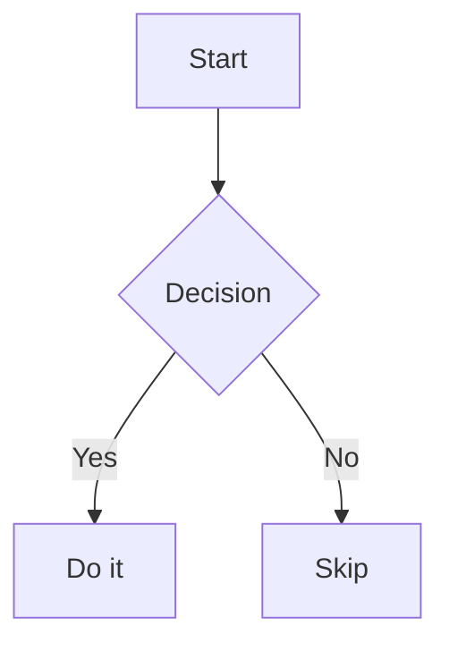

# Writing guide (blog v0.1.0)

This blog renders Markdown through a unified pipeline (GFM + footnotes + callouts + images + syntax highlighting).

## Article publish loop

Use this loop for public article work, especially when the user asks to review, publish, and deploy now:

1. Source check: verify current external claims against primary docs, release notes, repos, or official pricing/model pages before editing the public draft.
2. Voice pass: rewrite for a practical field-note tone, remove unsupported platform claims, and keep the article useful without exposing private paths, account details, tokens, or raw local prompts.
3. Visual pass: make the side/focal slot intentional. Set `image` to a distinct generated or licensed visual for the article side slot, set `row_image` for cards when useful, and reserve inline Markdown images for diagrams/screenshots inside the body. Avoid showing the same image in the hero side slot and again as the first body figure.
4. Link pass: put primary factual support in frontmatter `references`, put secondary/internal next reads in `further_reading`, and do not duplicate those lists as a Markdown section at the end of the body.
5. Rendered review: inspect the article route rather than judging Markdown only. Check the Ryan and Canopy shells, the `What I verified` section, Sources, Further reading, More like this, RSS/sitemap inclusion, and tag links.
6. Verification: run `pnpm check`, then `pnpm run build:blog` and `pnpm run audit:seo` for rendering changes. Also run `pnpm run build:blog:canopy` and `pnpm run audit:seo` when shared article content or metadata changes the Canopy lane.
7. Release only when requested: commit/push/deploy only when the user explicitly asks for it.

## Footnotes (GFM)

```md
Some point worth expanding.[^1]

[^1]: The footnote text goes down here. It can be multiple sentences.
```

## Callouts (Obsidian-style)

Non-collapsible:

```md
> [!NOTE] Why this matters
> This paragraph (and any additional quoted lines) become the callout body.
```

Collapsible (open by default with `+`):

```md
> [!WARNING]+ Read this before deploying
> This folds behind a disclosure triangle.
```

Collapsible (closed by default with `-`):

```md
> [!TIP]- Optional deep dive
> Keep this hidden unless the reader wants the extra detail.
```

Supported callout types are free-form (the label becomes a CSS class). Recommended set:

- `NOTE`
- `INFO`
- `TIP`
- `WARNING`
- `DANGER`

## Images (responsive + captions)

Store article images under:

```txt
static/img/articles/<article-slug>/...
```

Reference them from Markdown with root-relative URLs. If you include a title, it becomes a caption. Prefer generated responsive filenames when available (`-900w`, `-1200w`, `-1600w`); the renderer will add a matching `srcset` automatically for those sizes:

```md

```

Svelte routes/components can use the exported library component instead:

```svelte
<script lang="ts">
  import { Image } from '$lib';
</script>

<Image
  src="/img/articles/my-article/diagram-1600w.webp"
  alt="Alt text"
  caption="Caption text shown under the image"
  preset="content"
/>
```

## Code fences (syntax highlighting)

````md
```powershell
pnpm run build:blog
```

```ts
export function hello(name: string) {
  return `Hello ${name}`;
}
```
````

## Mermaid diagrams

````md

````
