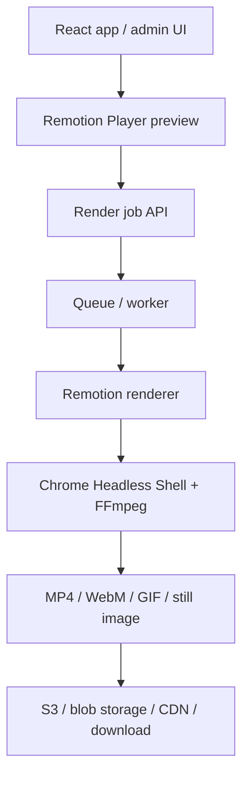

# Can You Use Remotion for Programmatic Video? Yes — But Read the Fine Print First

**Draft created:** June 4, 2026  
**Last updated:** June 4, 2026  
**Status:** working blog draft

Yes, you can use Remotion — and if your project is already React or TypeScript-heavy, you should probably test it.

Remotion is a framework for creating videos programmatically with React. Instead of building motion graphics manually in After Effects, exporting clips, and stitching everything together with raw FFmpeg commands, you can describe video compositions with components, props, data, CSS, SVG, Canvas, WebGL, audio, and normal frontend code.

That is a big deal.

For developers, especially frontend and platform engineers, Remotion turns video generation into something closer to application development. You can build reusable templates, pass in JSON data, render personalized clips, generate product videos, make social media assets, create explainers, export still images, or build a full internal video-generation pipeline.

But there are two things you should not gloss over:

* Remotion is not a simple MIT-style open-source dependency.
* Production rendering is usually a backend or cloud-rendering problem, not just a React component problem.

So the real answer is:

> **Use Remotion if the React-based authoring model fits your product and the licensing model fits your business. Do not adopt it blindly just because the GitHub repo looks good.**

## What Remotion is good at

Remotion is strongest when you want to generate videos from code, data, templates, or user input.

Good use cases include:

* personalized marketing videos
* product or e-commerce videos
* dynamic social media clips
* internal reporting videos
* SaaS tools that export video
* AI-generated motion graphics
* automated YouTube, TikTok, or Reels-style assets
* branded explainers
* data-driven animations
* screenshot and video mashups
* internal creative tooling

The core advantage is that you can treat video as a programmable output.

Instead of saying:

> “Open a design tool, manually animate this, export it, upload it.”

You can say:

> “Here is a React component. Here are the props. Here is the dataset. Render 200 versions.”

That changes the shape of the work.

For a web developer, Remotion feels natural because the building blocks are familiar: React components, CSS, TypeScript, npm packages, assets, and server-side rendering APIs.

## Why React is the killer feature

The main reason Remotion is compelling is not just that it renders videos.

FFmpeg renders videos. Plenty of tools render videos.

The interesting part is that Remotion lets you author the video with React.

That gives you:

* reusable components
* props-driven templates
* shared types
* conditional rendering
* data fetching
* package reuse
* CSS, SVG, Canvas, and WebGL support
* normal frontend workflow
* local preview through Remotion Studio
* embeddable previews with `@remotion/player`

For example, a product video could be driven by data like this:

```ts
type ProductVideoProps = {
  productName: string;
  price: string;
  imageUrl: string;
  tagline: string;
  brandColor: string;
};
```

Then your Remotion composition becomes a real component:

```tsx
export const ProductVideo = ({
  productName,
  price,
  imageUrl,
  tagline,
  brandColor,
}: ProductVideoProps) => {
  return (
    <div style={{ backgroundColor: brandColor }}>
      
      <h1>{productName}</h1>
      <p>{tagline}</p>
      <strong>{price}</strong>
    </div>
  );
};
```

That is a very different experience from dragging layers around manually for every variation.

For developers building SaaS tools, dashboards, content automation systems, or AI-assisted creative tooling, that model is powerful.

## Previewing video inside your app

One of the most useful parts of Remotion is `@remotion/player`.

The Player lets you embed a Remotion composition inside a normal React app. That means you can show users a preview of their video before sending it to a render worker.

A basic example looks like this:

```tsx
import { Player } from '@remotion/player';
import { ProductVideo } from './remotion/ProductVideo';

export function VideoPreview() {
  return (
    <Player
      component={ProductVideo}
      durationInFrames={180}
      compositionWidth={1920}
      compositionHeight={1080}
      fps={30}
      controls
      inputProps={{
        productName: 'Canopy Digital Site Audit',
        price: '$499',
        imageUrl: '/sample-report.png',
        tagline: 'Find the leaks in your website before Google does.',
        brandColor: '#111827',
      }}
    />
  );
}
```

That is where Remotion starts to feel less like a video tool and more like a product feature.

You can imagine a user changing a title, uploading an image, choosing a color scheme, picking a format, and watching the preview update in the browser.

Then, when they click export, the backend renders the final MP4.

That split matters:

```text
Player   = browser preview
Renderer = backend / cloud export
```

Do not confuse those two.

## The production architecture you probably want

For serious usage, I would not build this as “the React app renders the final video in the browser.”

I would start with this architecture:



For small internal tools, that worker might just be a Node or Bun process on a server.

For higher-scale rendering, Remotion has documented paths for AWS Lambda and other cloud setups. Lambda is especially interesting because Remotion can split renders across multiple functions, which can make large renders much faster.

But for a first pilot, keep it boring:

```powershell
npx create-video@latest --yes --blank remotion-spike
Set-Location .\remotion-spike
npm install
npm run dev
```

Then prove four things:

1. Can you build one real composition?
2. Can you pass real input props into it?
3. Can you render a final MP4?
4. Can you explain the licensing risk clearly?

If those pass, then it is worth integrating into an actual product.

## What Remotion can output

Remotion uses FFmpeg under the hood for encoding, so the output story is strong.

Common outputs include:

* H.264 MP4
* H.265 / HEVC
* VP8 / VP9 WebM
* AV1
* ProRes
* GIF
* MP3
* WAV
* AAC
* still images
* image sequences

For most web and product work, the default answer is probably still H.264 MP4. It is widely compatible and usually the least surprising option.

Use WebM or AV1 when you have a specific reason. Use ProRes when you are working in a more professional editing or alpha-channel workflow.

The boring choice is boring because it works.

## The licensing is the part to slow down on

This is the biggest caveat.

Remotion is public and source-available, but it is not a normal permissive open-source dependency like MIT.

The official docs say Remotion is free to use for individuals, nonprofits, evaluation use that is not commercial yet, and for-profit organizations with up to three employees. If you do not qualify, you need a company license.

That does not make Remotion bad. It just means you should treat it like a commercial dependency, not random npm glue.

The important questions are:

* Are you using it as an individual or very small company?
* Are you using it commercially?
* Are you building automation around it?
* Are you embedding the Player in a product?
* Are contractors involved?
* Would the client or company need a paid license?
* Are you building a product that depends on Remotion as a core feature?

If the answer is “yes” to the commercial/product questions, do the licensing check early.

Do not wait until after you build the feature.

## Where Remotion fits well

Remotion is a strong fit for React-first product teams.

If your team already writes React, TypeScript, and component-driven UI, Remotion feels like an extension of your existing workflow.

It also fits SaaS products with export features. If users customize something and then export a video, Remotion is a natural candidate.

It can also fit AI-assisted creative tools. If a coding agent or AI system generates React components, Remotion gives that output a concrete video-rendering target.

Internal automation is another good lane: reports, explainers, training clips, product updates, and internal comms can be generated from structured data.

Marketing operations may also benefit. If you repeatedly produce variations of the same video format, Remotion can turn that into a template-driven pipeline.

## Where I would be careful

Remotion is not always the right default.

I would be careful if:

* you need a fully permissive open-source license
* you are not a React team
* you need everything to render client-side in the browser
* your pipeline is already deeply built around After Effects
* you need GPU-heavy rendering everywhere
* you need Alpine Linux or unusual server environments
* you cannot accept Chrome, Headless Shell, and FFmpeg operational complexity
* you do not want a commercial dependency in the core of your product

The browser-side rendering story is especially important. Remotion has browser/client-side rendering options, but I would not make that the foundation of a production export pipeline yet unless you have tested the exact constraints.

For now, I would treat browser rendering as promising, not default.

## Remotion vs FFmpeg

The comparison with FFmpeg is useful because Remotion does not replace FFmpeg in the abstract.

FFmpeg is still the lower-level media engine.

Remotion gives you a higher-level composition system.

Use FFmpeg directly when you need:

* transcoding
* trimming
* stitching
* format conversion
* compression
* audio/video manipulation
* backend media plumbing

Use Remotion when you need:

* programmable visual composition
* reusable templates
* React-based animations
* data-driven video
* previewable video components
* productized video generation

A practical setup might use both.

Remotion for composition. FFmpeg for additional media processing.

That is not a contradiction. That is a sane pipeline.

## Remotion vs Motion Canvas

Motion Canvas is another code-based animation tool, and it is worth knowing about.

The rough distinction:

| Tool | Better default use |
| --- | --- |
| Remotion | React-based video generation, SaaS/product workflows, embeddable previews, data-driven templates |
| Motion Canvas | TypeScript animation authoring, educational/vector explainers, precise voiceover-timed motion graphics |

If I were building a SaaS feature that lets users generate branded videos from data, I would test Remotion first.

If I were making developer explainers or precise vector animations with voiceover timing, I would look seriously at Motion Canvas too.

The deciding question is simple:

> **Do I want this to behave like part of a React product, or like a dedicated animation authoring project?**

For productized video, Remotion has the stronger default story.

## How I would pilot it

I would not start with a grand architecture.

I would start with a one-week spike.

### Day 1: local proof

Create a blank Remotion project and render one video.

```powershell
npx create-video@latest --yes --blank remotion-spike
Set-Location .\remotion-spike
npm install
npm run dev
```

Then render:

```powershell
npx remotion render .\src\index.ts MyComposition .\out\test.mp4
```

### Day 2: real template

Build one realistic composition:

* title
* logo
* image/video asset
* background
* animated text
* music or sound
* data-driven props

### Day 3: app preview

Embed the composition with `@remotion/player` in a React app.

Prove that props can be edited from UI controls.

### Day 4: backend render

Create a small render endpoint or local worker that accepts JSON input and outputs an MP4.

### Day 5: operational review

Answer the boring but necessary questions:

* Where do rendered videos go?
* How are jobs queued?
* What happens when a render fails?
* How do you prevent abuse?
* What does one render cost?
* What license applies?
* What is the maximum expected render volume?
* What cloud path is acceptable?

If the spike survives those questions, Remotion is probably worth adopting.

## The main security gotchas

Remotion is not unusually scary, but video rendering pipelines can become expensive or leaky if handled lazily.

The big rules:

* Do not expose render endpoints without authentication.
* Rate-limit anything that can trigger cloud rendering.
* Do not leak AWS or cloud credentials to the browser.
* Be careful with environment variables passed into browser/render contexts.
* Do not casually disable browser security flags in production.
* Store only the assets the renderer actually needs.
* Treat user-uploaded media as untrusted.
* Put cost controls around render queues.

The most obvious failure mode is not someone “hacking the video.”

The obvious failure mode is someone triggering a pile of expensive renders and burning money.

## What this means for this blog

For `blog.ryanspice.com`, Remotion should be treated as a **build-time creative tooling lane**, not a production dependency.

The right local shape is:

```text
tools/remotion-graphs/
  Remotion source compositions
  render stills and videos locally
  copy static PNG/MP4/WebM outputs into static/img/articles/

src/lib/content/articles/
  Markdown references static rendered media only

production blog runtime
  SvelteKit + PHP adapter
  no live Remotion renderer
  no render endpoint
  no browser-side export
```

That keeps the blog fast, cheap, and deployable on the current PHP-static path while still letting the visuals get much better.

This is also the safest licensing posture for the blog right now: evaluate and render local creative assets first, then do a separate commercial/licensing review before making Remotion a feature of any client-facing product.

## My recommendation

For a React-heavy developer or product team, Remotion is worth a serious pilot.

It is especially attractive if you want to build:

* a video export feature
* a personalized marketing tool
* a social media automation pipeline
* an AI motion graphics generator
* a branded content engine
* an internal reporting/video system
* a SaaS product where video is generated from user input

But I would not adopt it casually.

The right posture is:

> **Technically strong. Commercially conditional. Operationally manageable if you design the render path properly.**

If the licensing works for your situation, Remotion is probably the best first tool to test for React-based programmatic video.

If the licensing does not work, or if you need a fully permissive dependency, look elsewhere before building around it.

Either way, the larger idea is clearly useful: video is becoming another programmable output surface.

For developers, that is the important shift.

We already generate pages, PDFs, emails, dashboards, and reports from structured data.

Generating videos from structured data is the next obvious step.

Remotion just happens to make that feel like frontend development instead of media production.

And for React teams, that is exactly why it is interesting.

## Sources and further reading

* [Remotion docs — Creating a new project](https://www.remotion.dev/docs)
* [Remotion docs — License & Pricing](https://www.remotion.dev/docs/license)
* [Remotion docs — Player](https://www.remotion.dev/docs/player)
* [Remotion docs — Server-Side Rendering](https://www.remotion.dev/docs/ssr)
* [Remotion docs — Client-side rendering](https://www.remotion.dev/docs/client-side-rendering)
* [Remotion docs — Encoding Guide](https://www.remotion.dev/docs/encoding)
* [Remotion docs — Security Best Practices](https://www.remotion.dev/docs/security)
* [GitHub — remotion-dev/remotion](https://github.com/remotion-dev/remotion)
