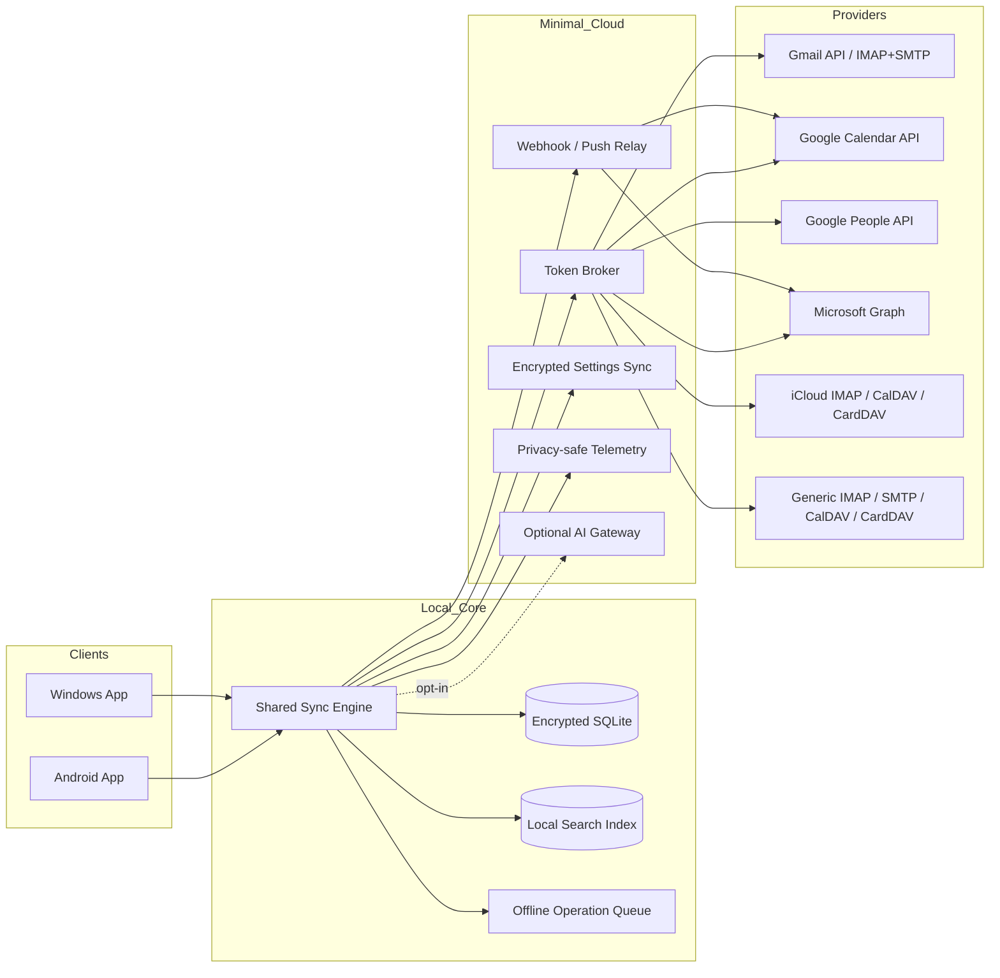
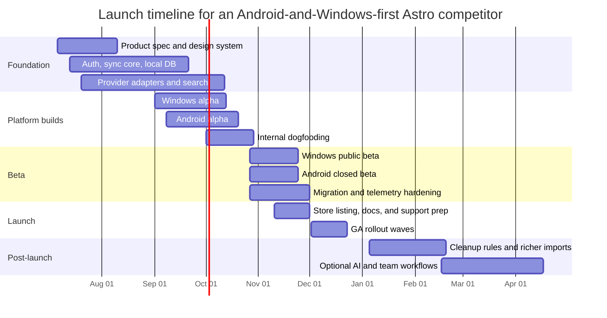

# Strategic Guide to Competing with Astro from Android and Windows First

## Executive summary

This report treats **Astro** as the discontinued AI email and calendar client that shipped on iOS, Android, Mac, and Slack, then added built-in calendar, Astrobot insights/commands, and team mentions before Slack acquired the company and shut the apps down on **October 10, 2018**. That interpretation fits your requested scope around email, calendar, contacts, migration, privacy, and launch strategy. Official Astro materials for the 3.0 launch explicitly list **iOS, Android, Mac, and Slack**; in the sources reviewed, I could not verify a separate first-party standalone browser inbox, so the “web” parity discussion below uses Astro’s **Slack/web-adjacent** workflow surface rather than a full browser mail client. citeturn1view2turn0search0turn29search0turn30search0

A competitive play in 2026 should **not** try to recreate Astro literally. Astro’s original differentiators were a unified inbox, a Priority/Other split, snooze/reminders/send later, integrated calendar, and an AI assistant that helped users clean up and act on email. In today’s market, those ideas are partly commoditized by Outlook, Spark, Canary, BlueMail, Gmail, and Thunderbird. The better opportunity is to use Astro’s workflow DNA as the base, then win on **local-first privacy, reliable mixed-provider support, fast offline sync, lower-latency UX on Windows and Android, and optional rather than mandatory AI**. citeturn26search1turn1view4turn15search1turn14search5turn4search0turn3search2turn5search7

Starting with **Windows and Android** is defensible if the goal is to establish a cross-platform power-user product before tackling Apple-native expectations. Windows remains the largest desktop OS globally and in Canada, while Android remains the largest mobile OS globally. More importantly, Windows has an explicit market opening because support for **Mail, Calendar, and People ended on December 31, 2024**, and Android has a lighter-weight opportunity because **Outlook Lite retired on May 25, 2026**. That creates two adjacent openings: a premium desktop workflow replacement on Windows, and a performance-sensitive, multi-account productivity client on Android. citeturn12search1turn12search5turn12search0turn16search0turn25search2

The recommended strategy is a **Windows-first public beta with Android in private beta in parallel**, built on a shared sync core and local encrypted datastore. The product thesis should be: **“One calm, fast command centre for mixed-provider email, calendar, and contacts — private by default, offline when needed, and optional AI only when asked.”** That gives you a clearer wedge than trying to out-AI Outlook or out-collaborate Spark on day one. The MVP should hit Astro’s core workflow parity, while v1.5 and v2 should add richer contacts, migration tooling, automations, and team features. citeturn16search0turn25search2turn9search0turn10search3turn10search0

## What Astro actually offered and what parity should mean now

Astro’s official and near-contemporaneous product coverage shows a product built around three ideas: **smart triage**, **calendar-aware workflow**, and **assistant-led actions**. On Mac, Astro offered a unified inbox, a **Priority / Other** split, snooze, reminders, a swipe-based triage model, cloud attachments, and priority-only notifications. By Astro 3.0, it added built-in calendar, Astrobot Insights, natural-language commands, team mentions, search by sender and subject, inbox-cleaning “Zap” actions, and daily/weekly digest emails. In Slack, Astrobot could answer calendar questions and expose that same assistant surface outside the mail UI. citeturn26search1turn1view2turn1view3turn1view4

The practical implication is that **feature parity vs Astro is necessary but not sufficient**. In 2026, Astro’s core ideas are table stakes; what matters is whether you can deliver them with **better trust, less friction, tighter mixed-account support, lower resource usage, and stronger platform-native UX on Android and Windows** than today’s incumbents. Outlook already bundles email, calendar, and contacts across desktop, mobile, and web. Spark already packages smart inbox, reminders, send later, and AI. Canary already packages privacy/security, read receipts, calendaring, and optional AI. BlueMail is already broad and free. Thunderbird already owns the open-source/privacy lane. citeturn15search1turn14search5turn4search0turn3search2turn5search0

### Astro feature inventory and the right parity target

| Astro capability | What official or primary sources show | Why it mattered | Recommended parity target |
|---|---|---|---|
| Unified inbox | Astro had a unified inbox across accounts. citeturn26search1 | Core Astro value prop; still expected for multi-account power users. | **Launch must-have** on both Android and Windows. |
| Priority / Other split | Astro separated email into Priority and Other. citeturn26search1turn26search10 | Helped users reduce overload without folders/rules setup. | **Launch must-have**, but make it user-tunable and explainable. |
| Snooze | Astro supported snoozing email for later. citeturn26search1turn1view2 | Essential “inbox zero” workflow mechanic. | **Launch must-have**. |
| Reminders / follow-up prompts | Astro offered reminders and Astrobot follow-up insights. citeturn26search1turn1view4 | Good bridge between mail and task intent. | **Launch must-have** for follow-up reminders; task integrations later. |
| Send later | Astro 3.0 linked scheduled sends into calendar context. citeturn1view2 | Important premium workflow feature. | **Launch must-have**. |
| Built-in calendar | Astro 3.0 supported Gmail and Office 365 calendars, per-account calendar selection, and event add/update. citeturn1view2 | Made Astro more than an inbox tool. | **Launch must-have** as agenda/day view; richer scheduling later. |
| Assistant commands | Astrobot supported natural-language commands and insights. citeturn1view4 | Distinctive brand layer. | **Do not lead with this**; ship as optional command palette + AI sidecar after core reliability. |
| Inbox cleanup / Zap | Astro could unsubscribe, archive, delete, mark read, move mail, and automate cleanup patterns. citeturn1view3turn1view4 | High user delight; strong retention feature. | **Launch partial parity**, full automations in post-launch. |
| Team mentions | Astro added `@mentions` in email and surfaced notifications in Astrobot Insights. citeturn1view3 | Interesting but niche collaboration layer. | **Post-launch**, not MVP. |
| Daily / weekly digests | Astro sent optional daily/weekly insights emails. citeturn1view3turn1view4 | Good re-engagement mechanic. | **Post-launch**; in-app digests first, email digests later. |
| Slack / web-adjacent assistant surface | Astro 3.0 explicitly launched on Slack and allowed calendar commands there. citeturn1view2 | Let Astro extend beyond the inbox screen. | **Later-stage integration**, after core app success. |

### The modern parity bar

The current bar is higher than Astro’s original bar because competing apps already expose many of these features. Outlook promotes multiple accounts with email, calendars, and contacts together; Spark emphasizes Smart Inbox, Send Later, Reminders, Set Aside, and AI; Canary emphasizes unified inbox, read receipts, calendar, and privacy/security; BlueMail emphasizes unified inbox, integrated calendar, push, AI, and broad protocol support; Thunderbird emphasizes a unified inbox plus free, open-source, privacy-forward positioning. A new entrant needs **Astro parity plus a sharper wedge**. citeturn15search1turn26search7turn14search5turn4search0turn3search2turn3search15turn5search0turn5search7

## Target personas and the product strategy for Android and Windows

A strong Android-and-Windows strategy should use **behavioural personas**, not demographic ones. The right segmentation is based on how many accounts people manage, how often they switch contexts, whether they are trapped between Google and Microsoft ecosystems, and how much they value privacy versus automation. That approach fits the current platform reality: Windows still dominates desktop share in Canada and globally, while Android remains the largest mobile OS globally even though iOS leads mobile share in Canada. citeturn12search5turn12search1turn12search0turn12search3

### Recommended personas

| Persona | Primary platform | Jobs to be done | Current pain points | What wins them |
|---|---|---|---|---|
| Mixed-suite professional | Windows first, Android second | Manage Gmail + Microsoft 365 + IMAP accounts in one workflow; act from inbox and calendar quickly | Context-switching between provider apps, weak offline flow, inconsistent keyboard shortcuts and account views | Unified inbox, explainable prioritization, calendar side panel, strong keyboard model, reliable search |
| Consultant or agency operator | Windows + Android | Handle many client identities, aliases, signatures, reminders, and scheduled sends | App sprawl, missed follow-ups, poor account separation, notification overload | Account colour coding, follow-up reminders, send later, quick alias/signature switching, per-account notification controls |
| Mobile-first founder / operator | Android first | Process email and calendar while moving between meetings and travel | Existing apps are heavy, noisy, or too enterprise; weak widgets and triage flow | Fast app start, excellent widgets, agenda + inbox home, one-handed triage, quiet-notification model |
| Low-resource Android user | Android only | Stay productive on slower devices and weaker networks | Full Outlook is heavy; Gmail is powerful but less workflow-centric for multi-provider power use | Lite mode, lower memory footprint, offline cache discipline, compressed sync, optional image loading |
| Privacy-sensitive independent professional | Windows + Android | Keep email content away from third-party AI training and minimise cloud copies | Distrust of proxy-based cloud inboxes and opaque AI | Local-first storage, opt-in AI, transparent data map, exportability, user-controlled telemetry |
| Open-workflow switcher | Windows + Android | Move from Thunderbird, Outlook, BlueMail, or Windows Mail without reconstructing setup by hand | Weak import/migration experiences and lost settings | Config import, contacts/calendar/file import, reliable re-authentication wizard, one-click account replay |

These personas map neatly to real market openings. On Windows, Microsoft ended support for Mail, Calendar, and People and pushed users toward new Outlook. On Android, Microsoft retired Outlook Lite and steered users to the full Outlook mobile app. Those two official shifts create room for a product positioned as **faster, calmer, more private, and less resource-hungry** than the defaults. citeturn16search0turn25search2

### Strategic positioning

The strongest strategic position is **not** “an AI email app.” That line is already crowded. The stronger position is:

> **A private, cross-provider personal command centre for email, calendar, and contacts — fast on Windows, lightweight on Android, and smart only when you ask for it.**

That positioning creates useful contrast with the market. Outlook is broad and bundled. Spark is polished and increasingly collaboration/AI-oriented. Canary is security-led. BlueMail is breadth-led. Thunderbird is freedom-led. Your opening is to be **workflow-led with trust**, combining the clarity of Astro’s original thesis with modern privacy and platform discipline. citeturn15search1turn14search5turn4search0turn3search2turn5search0

## Prioritized roadmap and competitive benchmarking

The roadmap should aim for **Astro parity in workflow**, not parity in branding. That means the first wave is about triage, scheduling, focused notifications, offline reliability, and multi-provider setup. The second wave is about richer cleanup, collaboration, and contacts intelligence. The third wave is about assistant surfaces, deeper automations, and distribution leverage. This sequencing reduces the risk of sinking time into flashy AI while the hard work of sync, auth, and performance is still immature. Google’s Gmail scopes remain restricted and can trigger extra verification and possible security assessment; Microsoft Graph change tracking and notifications are powerful, but they still demand careful permissions and sync design. citeturn9search0turn9search4turn10search3turn10search0

### Recommended roadmap

| Wave | Scope | Android priority | Windows priority | Why this order |
|---|---|---|---|---|
| Foundation | Shared sync core, auth, local DB, notifications, search index, design system | Must run on mid-range and low-resource devices; optimise battery and startup | Must support keyboard-heavy triage, system notifications, deep search, multi-window | Reliability and account setup are the real moat; without them, premium UX claims collapse. citeturn22search10turn22search9turn9search0turn10search3 |
| Launch MVP | Unified inbox, Priority/Other or Focused/Other, snooze, reminders, send later, agenda/day view, contacts lookup, widgets on Android, tray/shortcut model on Windows | Home screen widgets, quiet notifications, low-bandwidth sync, attachment deferral | Keyboard shortcuts, message pane, calendar side pane, system tray, drag/drop, file associations | This is the minimum viable Astro-style workflow. It also matches the current expectation set by Outlook, Spark, and Canary. citeturn26search1turn15search1turn14search5turn4search0 |
| Post-launch | Cleanup rules, unsubscribe suggestions, digest views, contact profiles, account migration pack, richer calendar views | Better widgets, Wear OS notifications later, share-to-app, camera/scan attachments | Batch actions, better rules UI, EML/ICS/VCF/PST helpers, stronger desktop integrations | These features improve retention and switching without blocking launch. citeturn1view4turn17search0turn17search4turn17search2 |
| Expansion | Optional AI sidecar, command palette, Slack/Teams actions, shared inboxes, team mentions, scheduling assistant, enterprise deployment | AI summarise/draft on demand, never default | Command palette, shared inboxes, Teams/Slack hooks, admin deployment tooling | Astro’s assistant idea becomes more powerful once the trust foundation is already in place. citeturn1view2turn1view4turn10search0turn8search17 |

### Competitive matrix for Android and Windows

| Product | Platform coverage relevant here | Strengths | Weakness or gap you can attack | Pricing signal | Source |
|---|---|---|---|---|---|
| Outlook | Windows, Android, web, desktop/mobile | Multiple accounts with email, calendars, contacts in one place; Android widgets; free base product | Broad, bundled, and default — harder to feel personal, private, or lightweight | Free; more features via Microsoft 365 plans | citeturn15search1turn15search2turn15search6 |
| Spark | Windows, Android, Mac, iPhone/iPad | Smart Inbox, Home Screen, Set Aside, Send Later, Reminders, AI, integrations | Premium price point; stores some notification-related email metadata on its servers | Spark Plus **$99/year or $10/month**; Spark Pro **$199/year or $20/month** | citeturn14search5turn14search3turn14search6turn14search8turn3search3turn14search15 |
| Canary Mail | Windows, Android, Mac, iPhone/iPad | Privacy/security posture, read receipts, calendar, templates, send later, optional AI, PGP/SecureSend in Pro+ | Less mainstream than Outlook; narrower ecosystem/network effects | Free; Growth **$36/year**; Pro+ **$100/year**; lifetime options | citeturn4search0turn4search1turn6view0 |
| BlueMail | Windows, Android, Mac, Linux, webmail | Very broad protocol support, unified inbox, integrated calendar, push, AI, collaboration | Positioning is broader but less sharply “focused workflow”; pricing detail is less transparent in parsed source | Free starter; paid Plus/Team/Enterprise tiers | citeturn3search2turn3search15turn7view1 |
| Thunderbird | Windows, Android, Linux, macOS | Free, open source, privacy-forward, unified inbox, desktop + Android ecosystem | Less polished assistant/workflow layer; fewer premium convenience features out of the box | Free, donation-supported | citeturn5search0turn5search7turn5search14 |
| Gmail baseline | Android only | Excellent default on Android, multiple account support, powerful search, AI in Google ecosystem | Not a Windows desktop competitor; less differentiated for premium cross-provider workflow | Free / Workspace ecosystem | citeturn28search4turn28search10 |

### What the benchmarking implies

To be competitive, you do **not** need to beat every rival on everything. You need to beat them on a coherent stack of outcomes:

1. **Better mixed-provider flow than Outlook and Gmail.**  
2. **Better trust model than Spark.**  
3. **Less complexity than Thunderbird.**  
4. **Sharper focus and calmer UX than BlueMail.**  
5. **Broader mainstream appeal than Canary.**  

That points to a product that sits between enterprise utility and indie trust: polished, heavy on workflow, moderate on collaboration, and conservative on cloud dependence. citeturn15search1turn14search15turn5search0turn3search2turn4search0

## Technical architecture, integrations, offline strategy, and migration

The architecture should be **local-first, provider-aware, and cloud-minimal**. Email, calendar, and contacts are all sync-heavy domains with different protocol behaviours and policy burdens. If you proxy too much through your own servers, you increase privacy risk, compliance scope, and verification pain — especially for Gmail restricted scopes. If you keep too much logic only in the UI layer, you make offline reliability and cross-platform consistency harder. The right balance is a **shared sync core + local encrypted store + minimal cloud control plane**. citeturn9search0turn9search4turn10search3turn10search0

### Recommended stack options

| Stack option | Best for | Delivery speed | Platform fit | Long-term moat | Recommendation |
|---|---|---:|---:|---:|---|
| Flutter UI + Rust core | Small-to-mid team that wants Android + Windows quickly | Fast | Good | High | **Best practical MVP path** |
| Native UI + Rust core | Larger team, premium platform polish, strongest Win/Android fit | Medium | Excellent | Very high | Best premium path if budget allows |
| React Native + Windows + native modules | JS-heavy team prioritising familiarity | Medium | Mixed on Windows | Medium | Viable, but Windows polish risk is higher |
| Pure Electron/Tauri desktop + separate Android | Fast desktop start, but split mobile strategy | Medium | Weakest combined fit | Medium | Not recommended as primary long-term architecture |

The technical recommendation is therefore:

- **Shared core**: Rust for sync engine, MIME parsing, protocol adapters, crypto helpers, op queue, search indexing service.
- **UI shell**: Flutter for first release if speed matters most.
- **Local data**: SQLite with encryption at rest; FTS for message and contact search.
- **Background work**: Android WorkManager; Windows packaged desktop app with modern APIs via Windows App SDK / MSIX.
- **Cloud**: only token brokerage, webhook ingress, encrypted settings sync, billing state, and privacy-safe telemetry. citeturn22search10turn22search9turn22search11turn22search23

This design aligns with the platform and provider realities. Android’s recommended path for guaranteed background work is WorkManager. Windows App SDK provides the modern Windows API/tooling surface, and packaged MSIX deployment remains important for Store distribution and flighting. Google Calendar and People both support incremental sync tokens, and Microsoft Graph supports delta queries and change notifications for efficient local synchronization. citeturn22search10turn22search9turn22search11turn9search2turn10search1turn10search3turn10search0

### Integration strategy

| Integration target | Recommended method | Why | Key caution |
|---|---|---|---|
| Gmail / Google Workspace mail | Gmail API where necessary; IMAP/SMTP support as fallback path | Best message semantics and labels when available; broad compatibility | `https://mail.google.com/` and Gmail scopes are restricted and can trigger extra verification and possibly security assessment if you store/transmit restricted data on servers | citeturn9search0turn9search13turn9search4 |
| Google Calendar | Calendar API with incremental sync | Good incremental sync via `syncToken` | Need token lifecycle handling and full re-sync fallback | citeturn9search2 |
| Google Contacts | People API | Supports read/manage/sync; supports `nextSyncToken` flows | Sync token expiry handling matters | citeturn10search2turn10search1turn10search9 |
| Microsoft 365 / Outlook.com / Exchange Online | Microsoft Graph for mail, calendar, contacts | Single modern API surface for Outlook resources | Permissions/admin-consent friction; webhook subscriptions need renewal logic | citeturn10search10turn10search6turn10search4turn10search0 |
| iCloud | IMAP/SMTP for mail; CalDAV/CardDAV for calendar/contacts | Standards-based compatibility path | App-password and setup friction; must handle iCloud-specific auth quirks carefully | citeturn27search0turn27search6turn27search9 |
| Generic email / calendar / contacts | IMAP/SMTP + CalDAV/CardDAV | Widens market and reduces platform lock-in | Provider inconsistency and poorer advanced semantics | citeturn27search16turn27search6turn27search1 |

### Offline and sync strategy

The right offline model is **server-canonical, local-first**. That means the provider remains the source of truth for message bodies, event state, and contacts, but every client stores a complete local working set, plus an operation log for offline actions. Messages archived offline, reminder edits, snooze updates, read-state changes, and event changes should all enter a queued operation log, then replay once connectivity returns. Because Graph delta query and Google sync tokens support incremental change detection, you do not need CRDT-style complexity for the first version; you need strong conflict rules, tombstone handling, and visible retries. citeturn10search3turn10search6turn9search2turn10search1

A practical sync policy is:

- **Initial full sync** per account and data class.
- **Incremental sync** thereafter using provider-native cursors.
- **Webhook/change notification shortcuts** for fast freshening where available.
- **Local search first**, with cloud/provider search as a fallback.
- **Attachment hydration on demand**, with pinned/downloaded attachments available offline.
- **Smart prefetch** for the next 3–7 days of calendar and top-priority threads.
- **Lite mode on Android** that reduces image prefetch, attachment caching, and background frequency.

This model is also the safest way to support privacy. Google’s docs explicitly warn that restricted Gmail scopes require additional verification and potentially a security assessment, especially if restricted data is stored or transmitted through your servers. Keeping most mailbox content local dramatically improves the trust story, even though it does **not** remove Google’s verification obligations. citeturn9search4turn9search0turn9search11

### Migration, import, and export flows

A winning migration strategy should recognise a real truth about email apps: in many cases, **you are not migrating the mailbox**, because the provider already hosts it. You are migrating **setup, preferences, local drafts, local exports, contacts, calendars, reminders, and muscle memory**. Windows Mail exports `.eml` messages plus `.ics` calendar files, Outlook exports contacts as `.csv` and can export mailbox data as `.pst`, and Thunderbird already supports desktop-to-Android settings export. That gives you a very practical blueprint for your own migration tooling. citeturn17search0turn17search2turn17search4turn5search2

| Migration source | Import target in your app | What to support at launch | What to defer |
|---|---|---|---|
| Windows Mail / People | Local mail archive + calendar + contact setup | Import `.eml`, `.ics`, account replay wizard, contact CSV/VCF | Rich rule conversion |
| Outlook / new Outlook | Contacts, calendars, mailbox archive | CSV and ICS first; PST assistant later on Windows only | Full PST parity at MVP |
| Thunderbird | Account settings import, folder prefs | QR/config import concept, account replay, signature import | Add-on migration |
| Spark / Canary / BlueMail | Account reconnect, signature/templates import where export exists | “Reconnect your provider accounts” flow plus manual import pack | Deep proprietary migration |
| Generic | ICS, CSV, VCF, EML | Full support | MBOX/PST advanced tooling |

Recommended migration UX:

1. **Choose source app**.  
2. **Reconnect accounts first** so server-hosted data lands immediately.  
3. **Import local assets**: signatures, contacts, calendars, templates, local archives.  
4. **Map preferences**: account colours, notifications, swipe actions, reminder defaults.  
5. **Verify**: show a migration completion dashboard with anything not imported and why.  

That dashboard is important because trust increases when the product is explicit about what it did and did not migrate. Astro users learned this the hard way when the Slack shutdown notice meant some local states like snoozed or scheduled messages could become problematic near shutdown, whereas server-synced provider accounts themselves were still portable. citeturn28search18turn29search0turn30search0

## Privacy, security, compliance, analytics, and monetization

A modern email-calendar app lives or dies on trust. That trust is partly product design and partly regulatory hygiene. In Canada, PIPEDA applies to private-sector organizations handling personal information in commercial activity and is built around principles like consent, limiting collection, safeguards, openness, access, and challenging compliance. PIPEDA also includes breach notification and record-keeping duties where there is a real risk of significant harm. Google Play requires Data safety disclosures, and Microsoft Store requires a privacy policy if you access, collect, or transmit personal information. GDPR and California privacy law further reinforce data minimization, transparency, and user rights. citeturn24search12turn24search4turn24search9turn24search5turn23search0turn23search2turn24search10turn24search3

### Privacy and security model

The recommended privacy/security posture is:

- **Mailbox content local by default**.
- **No AI training on email or calendar content**.
- **AI features opt-in, per action**, not background-default.
- **No content retention in telemetry**.
- **Zero raw subject/body leakage in logs**.
- **Encrypted local storage and encrypted transport**.
- **Role-separated access for operational staff**.
- **Public data map** documenting every collected field and why.
- **Simple export and delete controls**.
- **Independent security review before large-scale launch**.

This posture is also strategically differentiating. Spark’s privacy documentation states that it syncs some message subject/partial-message information to produce notifications. Canary explicitly markets that emails are not used to train AI and that AI features are optional, while Thunderbird emphasizes that it doesn’t collect personal data, sell ads, or secretly train AI with private conversations. Users will increasingly compare your trust posture against those explicit claims. citeturn14search15turn6view0turn5search0

### Analytics and telemetry plan

Instrumentation should separate **product analytics**, **operational telemetry**, and **security telemetry**.

| Telemetry layer | What to collect | What not to collect | Governance |
|---|---|---|---|
| Product analytics | Activation steps, feature usage, account provider mix, reminder completion, widget adoption, retention cohorts | No subjects, snippets, recipient names, or attachment names | Opt-out by default for consumer mode; opt-in prompt for diagnostics |
| Operational telemetry | Sync duration, queue backlog, failed auth, webhook lag, crash traces, search index size | No content payloads | Short retention, internal-only |
| Security telemetry | Login anomalies, token refresh failures, device count, unusual export volume | No message bodies | Separate access controls and alerting |

A good principle is **data minimization in the event schema itself**. For example, measure “scheduled_send_created” instead of storing any send content. Measure “calendar_sync_latency_ms” instead of storing event titles. This aligns with PIPEDA’s limiting-collection principle, GDPR’s Article 5 principles, and the disclosure realities of Google Play’s Data safety section and Microsoft Store privacy review. citeturn24search4turn24search10turn23search0turn23search2

### Monetization strategy

For this category, the strongest model is **freemium with clear paid workflow value**, not paywalling basic access. Outlook is free at the base layer and upsells Microsoft 365 value; Spark charges meaningfully for Plus and Pro; Canary splits productivity and security tiers; BlueMail has free and paid team/enterprise tiers; Thunderbird stays free and donation-funded. That means your monetization should be understandable in one glance. citeturn15search1turn15search6turn3search3turn6view0turn7view1turn5search0

| Plan | Recommended price range | Included | Why it works |
|---|---:|---|---|
| Free | $0 | Up to 2 accounts, unified inbox, basic calendar agenda, search, basic snooze/reminders, local-only mode | Enough to prove trust and habit |
| Pro Individual | **CAD $6–12/month** or **CAD $60–110/year** | Unlimited accounts, send later, advanced reminders, rule suggestions, contact profiles, cross-device settings sync, priority notifications, export/import tools | Direct competition with Canary Growth and below Spark Plus |
| Pro Privacy / Security | **CAD $12–18/month** or **CAD $120–180/year** | Pro + advanced encryption options, policy controls, audit log, admin export controls, premium support | Good match for consultants and small teams |
| Team | **CAD $10–20/user/month** | Shared inboxes, delegation, mention workflows, admin console, seat management, billing control | Opens MSP and small-business channel |
| Lifetime option | Optional, selective | Windows-only or early-adopter offer | Can work tactically, but avoid relying on it for core revenue |

For Android, Google Play subscriptions remain the simplest default path, though Google continues to evolve billing flexibility in some markets. For Windows, Microsoft Store is attractive because Microsoft explicitly supports flexible monetization and even allows your own commerce platform, which can preserve margin and pricing control. citeturn11search0turn11search2turn11search4turn11search12turn8search17

## Go-to-market, launch operations, KPIs, risks, and tactical checklists

The go-to-market motion should treat this as a **workflow product**, not a generic email utility. People do not switch inboxes casually. They switch when a product clearly promises that it will save them attention, reduce missed follow-ups, improve mixed-account work, and feel safer than what they use today. Your messaging should therefore be concrete:

- **For Windows**: “A real desktop replacement for Mail, Calendar, and People — built for mixed-provider power use, not just another web wrapper.”  
- **For Android**: “A calmer, faster, private multi-account inbox and agenda built for real mobile work — including lower-resource devices.”  
- **For both**: “Optional AI, never mandatory. Your data stays yours.”  

Those angles are well supported by current platform context: Windows’ built-in Mail/Calendar/People lineage is over, new Outlook is free and dominant, and Outlook Lite on Android has already been retired. citeturn16search0turn15search10turn25search2

### Distribution channels and partnerships

Your best channels are likely to be:

- **Product-led app-store discovery** on Google Play and Microsoft Store.
- **Direct download for Windows** for margin control and faster hotfixes.
- **Community and creator channels** focused on inbox zero, productivity, Windows, Android, privacy, and mixed Google/Microsoft workflows.
- **MSP / consultant partnerships** for small-business deployment.
- **Google Workspace and Microsoft 365 migration specialists** who often sit closest to account complexity.
- **Open-source / privacy communities** if you make your trust posture a real differentiator.

For launch operations, use staged releases. Google Play supports internal, closed, and open testing tracks, and Microsoft Store supports package flights for controlled groups. That makes it practical to run a **private reliability wave**, then a **public beta**, then a **staged GA**. Android developer identity verification and store disclosure obligations should be docked early in the project plan, not left to the end. citeturn8search1turn8search15turn8search13turn8search2turn8search9turn11search3turn11search7

This schedule is realistic only if release scope stays disciplined. The platform-dependent work is not the UI alone; it is background sync, notification handling, auth edge cases, migration tooling, and store-readiness. That is why the fastest route is a constrained MVP on a shared core, then feature expansion once crash-free sync and auth metrics are stable. citeturn22search10turn22search9turn8search1turn8search2

### Costs and timelines

The following ranges are **modelled estimates**, not sourced market quotes. They assume a blended fully loaded senior-team cost of roughly **CAD $18k–28k per FTE-month** and a product team composed of engineering, design, QA/release, and product/ops.

| Delivery model | Team shape | Timeline estimate | Cost estimate | Notes |
|---|---|---:|---:|---|
| Lean MVP | 1 PM/founder, 3 engineers, 1 designer, shared QA/release | 6–9 months | **CAD $650k–1.4M** | Hits launch MVP only |
| Competitive v1 | 1 PM, 5 engineers, 1 designer, 1 QA/release, part-time security/compliance | 9–14 months | **CAD $1.4M–3.0M** | More realistic for strong Windows + Android launch |
| Strong v1 + team features | 1 PM, 6–7 engineers, 1 designer, 1 QA/release, security/compliance, support lead | 12–18 months | **CAD $2.2M–4.5M** | Supports shared inboxes, admin, richer migration |

### KPIs and success metrics

The launch scorecard should emphasise **activation, trust, reliability, retention, and willingness to pay**.

| KPI area | Metric | Good early target |
|---|---|---:|
| Activation | % of installers who connect at least one account | 45–60% |
| Activation | % who complete first successful sync within 5 minutes | 80%+ |
| Activation | % who perform first triage action in first session | 50%+ |
| Reliability | Crash-free sessions | 99.5%+ |
| Reliability | Successful background sync jobs | 97%+ |
| Reliability | OAuth reconnect failure rate | <3% |
| Engagement | D7 retention | 25–35% |
| Engagement | D30 retention | 15–25% |
| Engagement | Weekly active users who use snooze/reminders/send later | 35%+ |
| Monetization | Free-to-paid conversion within 90 days | 2–6% initially |
| Support | Tickets per 1,000 MAU | Downward trend after launch month |
| Trust | % of users keeping analytics opted in | 50%+ if truly privacy-safe and well explained |

### Risks and mitigation

| Risk | Why it matters | Mitigation |
|---|---|---|
| Gmail restricted-scope verification delays | Can block or slow Gmail mailbox functionality and launch | Keep mailbox content local; request minimum viable scopes; start verification early; stage non-Gmail providers if needed | 
| Server-side privacy overreach | Users in this category care deeply about trust and data handling | Local-first design, optional AI, public data map, explicit telemetry controls |
| Android battery / background limits | Poor sync reliability destroys confidence | Use WorkManager properly, design for incremental sync, use smart refresh instead of brute-force polling |
| Windows release friction | Packaging, certification, update flow can slow iteration | Use MSIX/package flights plus direct-download fallback; automate signing and staged release ops |
| Migration disappointment | Email app switches fail when imports are vague or partial | Transparent migration dashboard, reconnect-first design, file imports for local artifacts |
| Feature creep | AI and collaboration can bury core sync quality | Hard-gate release to workflow MVP; make AI a post-launch slice |
| Channel lock-in | Depending only on app stores compresses margin and control | Use Microsoft Store plus direct Windows distribution; use Google Play as primary Android channel |
| Marketing compliance mistakes | Lifecycle emails and waitlists can violate consent rules, especially in Canada | Build CASL-compliant permission capture, identification, unsubscribe, and consent records into CRM from day one |

The compliance point matters more than many teams expect. Under CASL, commercial electronic messages generally require consent, identification, and an unsubscribe mechanism, and the sender bears the burden of proving consent. That matters for waitlists, launch emails, referral programs, and digest experiments just as much as it matters for newsletters. citeturn13search1turn13search2turn13search6

### Tactical pre-launch checklist

- [ ] Finalize product thesis: **fast, private, cross-provider workflow**, not generic AI mail.
- [ ] Freeze MVP scope to unified inbox, focused triage, reminders, send later, agenda, contacts lookup, search, widgets/tray, export/import basics.
- [ ] Start Google OAuth verification and scope review early; document exactly why each scope is needed. citeturn9search4turn9search11
- [ ] Implement Graph delta and change-notification subscription renewal before public beta. citeturn10search3turn10search0
- [ ] Complete privacy policy, data inventory, PIPEDA/GDPR-ready retention and deletion policies, and Play/Microsoft store disclosures. citeturn24search4turn23search0turn23search2
- [ ] Set up Play internal/closed testing and Microsoft Store package flights. citeturn8search1turn8search2turn8search9
- [ ] Build migration pack for Windows Mail, Outlook contacts/calendar, Thunderbird settings import, ICS/CSV/VCF/EML.
- [ ] Create performance budgets for cold start, search latency, sync latency, and battery/network usage.
- [ ] Prepare support content for account setup, reconnect, migration, and privacy FAQs.
- [ ] Run a no-surprises beta: publish known limitations explicitly.

### Tactical post-launch checklist

- [ ] Review OAuth drop-off, sync failure, crash, and migration-completion dashboards daily for the first 30 days.
- [ ] Prioritize fixes to account setup, background sync, and notification errors before shipping net-new AI features.
- [ ] Launch cleanup automations and richer migration only after crash-free and sync-success thresholds are stable.
- [ ] Add in-product prompts at moments of success, not frustration, to encourage reviews.
- [ ] Segment acquisition by user intent: Windows replacement, Android multi-account power use, privacy-first users, mixed Google/Microsoft users.
- [ ] Publish transparent changelogs and trust updates.
- [ ] Run pricing experiments only after activation and D30 retention settle.
- [ ] Build early partner loop with consultants/MSPs who manage Google Workspace and Microsoft 365 migrations.
- [ ] Decide on macOS timing only after the shared core, migration system, and monetization convert on Windows and Android.

## Practical bottom line

If the objective is to become competitive with Astro’s original promise, the winning path is **not** to mimic a 2018 AI mail brand. The winning path is to ship a **2026-grade, cross-provider workflow product** that preserves Astro’s best ideas — focused inbox, calendar-aware follow-up, quick cleanup, and assistant-style actions — while solving the things Astro never had the chance to finish at scale: **first-class Windows support, Android performance discipline, serious migration, modern trust defaults, and optional rather than invasive AI**. That is where you can be competitive now. citeturn26search1turn1view2turn1view4turn16search0turn25search2turn15search1turn14search5turn4search0

The most practical strategic call is:

- **Public beta on Windows first** to capture displaced desktop users and monetize earlier.  
- **Android closed beta in parallel**, tuned for low friction, widgets, and lighter resource use.  
- **Shared local-first sync core** from the beginning.  
- **Astro parity on workflow**, not on branding.  
- **AI as a post-launch accelerant**, not the launch story.  

If you execute that way, you are not just “building an Astro competitor.” You are building the product Astro was pointing toward, but with the platform openings and trust expectations of 2026. citeturn16search0turn25search2turn12search1turn12search0turn9search0turn10search3